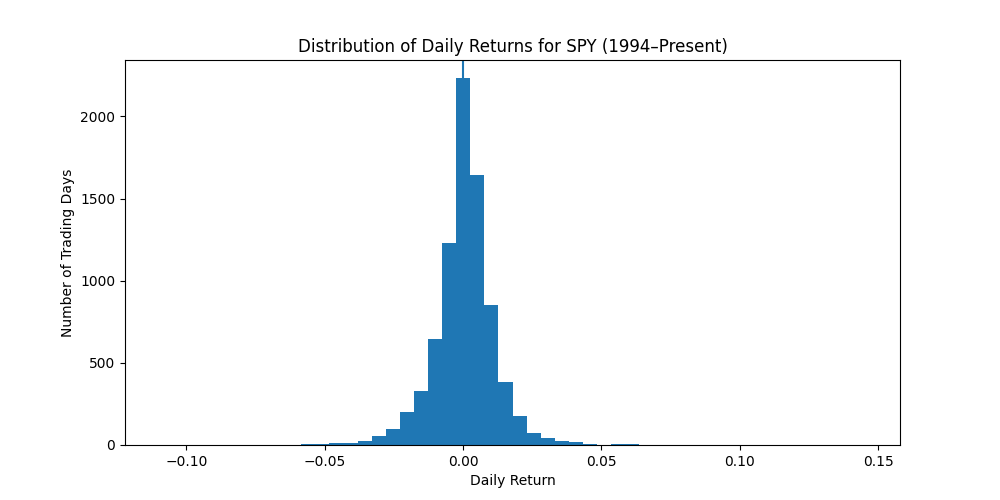

# Machine Learning Model Predicts Next-Day Market Direction Using Historical Trading Patterns

## Hook

Every day, the stock market moves in ways that can feel unpredictable. Small changes in price can have a big impact on investors, yet it is often unclear what drives these movements. This project explores whether patterns in past market behavior can help everyday investors better anticipate short-term trends.

## Problem Statement

Investors are constantly making decisions about when to buy or sell, but short-term market movements are difficult to interpret. While there is a large amount of available data, such as past prices and trading activity, it is not always easy to turn that information into clear insights. Many investors rely on simple indicators or guesswork, which can lead to inconsistent results. The problem this project addresses is how to use historical market data to provide clearer, more reliable signals about whether the market is likely to move up or down the next day.

## Solution Description

This project builds a data-driven tool that analyzes patterns in historical stock market data to help identify potential short-term trends. By examining features such as recent price changes, average trends over time, and trading activity, the model highlights signals that may suggest whether the market will increase or decrease. The goal is not to predict the market with certainty, but to provide investors with an additional layer of insight that can support more informed and confident decision-making.

## Chart

The chart below shows the distribution of daily returns for the S&P 500 ETF (SPY). Most daily movements are small, clustered near zero, but there are occasional larger swings. This highlights both the difficulty of predicting short-term movements and the importance of identifying subtle patterns in the data.

